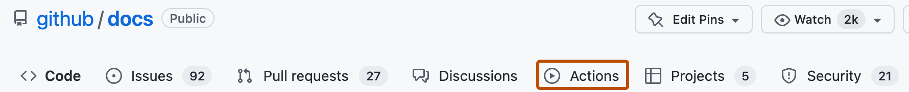

🛠️ Click the Workflow (e.g., "Terraform Manual Trigger")
You'll see it listed in the left panel.

▶️ Click the "Run workflow" button

Checkout your repo code

Setup Terraform

Configure AWS credentials

Run terraform init

Run terraform plan (using the secrets you provide as environment variables)

Run terraform apply -auto-approve (applying the changes automatically)