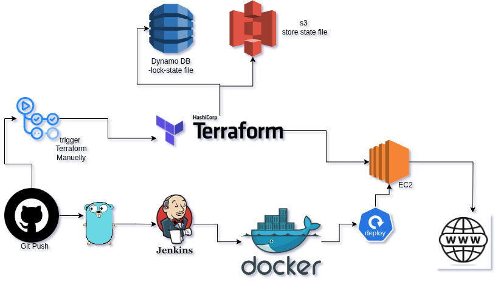

## 🖼️ Overview
📌 Project Overview: Terraform Automation with Jenkins & GitHub Actions
This project automates the end-to-end infrastructure provisioning and deployment pipeline using Terraform, GitHub Actions, and Jenkins on AWS.

## 🖼️ Architecture Diagram

## 🎯 Goal

To create a robust CI/CD workflow that:

- Provisions infrastructure using **Terraform**
- Utilizes a **remote backend (S3 + DynamoDB)** for secure state management
- Triggers a **Jenkins job** that pulls deployment logic from a separate application repository

---

## 🧱 Infrastructure Provisioning

Infrastructure is provisioned using **Terraform** and includes the following resources:

- 🖥️ **EC2 Instance** — Hosts Jenkins
- 📦 **S3 Bucket** — Stores remote Terraform state with versioning enabled
- 🗃️ **DynamoDB Table** — Used for state locking to prevent concurrent runs

---

## 🔁 CI/CD Workflow

### Continuous Integration (CI)

- Triggered via **GitHub Actions**
- Automatically runs `terraform apply` on push or merge to main
- Uses the remote backend for state management

### Continuous Deployment (CD)

- GitHub Actions sends a **webhook** or **API token trigger** to Jenkins
- Jenkins:
  - Pulls the pipeline logic from a `Jenkinsfile` in this repository
  - Clones a **separate app repository**
  - Executes build, test, and deploy stages

---

## 🔐 State Management

- 📁 **Backend:** S3 bucket with versioning to maintain Terraform state history
- 🔒 **Locking:** DynamoDB table to prevent concurrent execution and ensure consistency

---

## 🛠️ Technologies Used

| Tool            | Purpose                                |
|-----------------|----------------------------------------|
| Terraform       | Infrastructure as Code                 |
| GitHub Actions  | Continuous Integration & automation    |
| AWS EC2         | Host Jenkins CI/CD server              |
| AWS S3          | Remote state backend for Terraform     |
| AWS DynamoDB    | State locking for Terraform            |
| Jenkins         | Continuous Deployment & pipeline logic |

---

## ✅ Outcome

- Fully automated and version-controlled **CI/CD pipeline**
- Secure and scalable **infrastructure provisioning**
- Clean **separation of responsibilities** between Terraform and Jenkins
- Realistic, production-like pipeline for DevOps practice or demonstration

---

